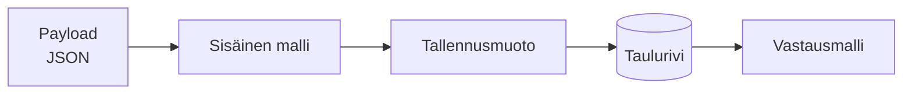

# <Datavirran nimi>

> **Mallipohja.** Kopioi tiedostoksi `moduulit/<moduuli>/datavirrat/<nimi>.md`.
> Kuvaa miten data muuttaa muotoaan prosessin edetessä ja **mikä rakenne missäkin
> kohtaa on käytössä**.
>
> Suhteelliset polut alla ovat kirjoitettu **kohdesijainnista** käsin
> (`moduulit/<moduuli>/datavirrat/`) — ne toimivat vasta kun tiedosto on
> kopioitu sinne.

## Yleiskuva

## Vaiheet — mitä kenttiä koodilla on käytettävissä

> Painopiste: **mitkä datakentät ovat koodin käytettävissä missäkin vaiheessa**,
> ei pelkät tietokannan sarakkeet. Kussakin solmussa dataa hallitsee jokin
> skeema/tyyppi (validointiskeema, tyyppimäärittely, ORM-malli, taulu).
> Linkitä hallitseva skeema jaettuun
> [`datamallit/`](../../../datamallit/)-kuvaukseen tai paikalliseen
> datarakenteeseen.

| # | Kohta koodissa | Hallitseva skeema/tyyppi | Käytettävissä olevat kentät | Muutos edelliseen |
|---|----------------|--------------------------|-----------------------------|-------------------|
| 1 | <esim. reitin käsittelijä, `…:rivi`> | [<skeema>](../../../datamallit/<x>.md) / JSON-payload | `<kentät>` (tai "koko skeema") | (sisääntulo) |
| 2 | <esim. logiikkakerros, `…:rivi`> | <tyyppi/malli> | <kentät> | `+ <johdettu>`, `− <tekninen>` |
| 3 | <esim. tallennus, `…:rivi`> | taulu / sarjallistettu muoto | <tallennettavat kentät> | <mitä pudotetaan> |

## Muunnokset (kenttätason delta)

> Kuvaa mitä kenttiä koodi lisää/johtaa/pudottaa solmujen välillä ja millä
> operaatiolla. Nämä ovat jäljitettävissä koodista.

- **Vaihe 1 → 2:** <operaatio> — `<moduuli>/src/...:rivi`. Lisää/poistaa: `…`.
- **Vaihe 2 → 3:** …

> **Sarjallistetut kentät:** kun data kirjoitetaan JSON-/JSONB-sarakkeeseen,
> blobiin tai "payload"-kenttään (tai luetaan sieltä), merkitse solmuun että
> **sisältö on skeemamääriteltyä** ja linkitä sisällön datamalliin. Näin
> kenttäjoukko ei "katoa" kenttään. Mainitse (de)serialisointikohta
> (`<moduuli>/…:rivi`).

> **Aidosti dynaamiset kohdat** (datalla rakennetut avaimet, yhdistäminen
> ennalta tuntemattomaan objektiin) — merkitse `> TODO: dynaaminen, ei
> staattisesti pääteltävissä` äläkä arvaa kenttäjoukkoa.

## Liittyvät

- Prosessi: [<prosessi>](../prosessit/<x>.md)
- Datarakenteet: [<rakenne>](../datarakenteet/<y>.md)
