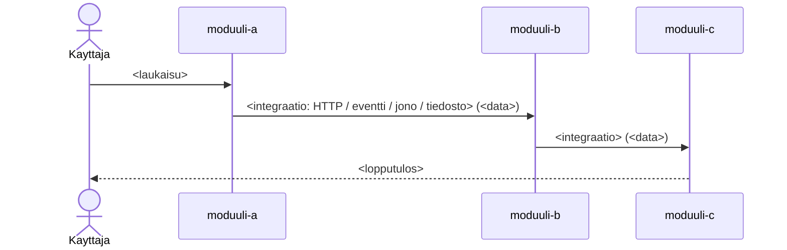

# <Järjestelmäprosessin nimi>

> **Mallipohja.** Kopioi kansioon `jarjestelmaprosessit/`. Kuvaa **end-to-end**
> -kulku, joka ylittää moduulirajat: mistä alkaa, mitä moduuleja läpäisee ja
> missä järjestyksessä, ja mikä data siirtyy kussakin hypyssä. **Ei** yhden
> moduulin sisälogiikkaa — siihen linkitetään moduulin omaan prosessikuvaukseen.

## Yhteenveto

- **Laukaisin:** <mistä ketju alkaa (käyttäjä/UI/ajastus/eventti)>
- **Lopputulos:** <mikä on lopputila koko ketjun jälkeen>
- **Moduulit järjestyksessä:** <moduuli-a → moduuli-b → …>
- **Synkroninen vai asynkroninen:** <ja missä kohdassa kulku katkeaa jonoon>

## Kulku (moduulirajat ylittävä)

## Hypyt

> Jokainen hyppy: mikä moduuli, mitä tekee (lyhyesti), millä integraatiolla, mikä
> data siirtyy, ja linkki moduulin omaan prosessiin (porautuminen).

| # | Moduuli | Mitä tekee | Integraatio | Siirtyvä data | Moduulin prosessi |
|---|---------|-----------|-------------|---------------|-------------------|
| 1 | `<moduuli-a>` | <lyhyt> | HTTP / eventti / jono / tiedosto / jaettu DB | [<datamalli>](../datamallit/<x>.md) | [prosessi](../moduulit/<moduuli-a>/prosessit/<y>.md) |
| 2 | `<moduuli-b>` | … | … | … | … |

## Integraatioiden tunnisteet

> Se, mikä sitoo hypyn yhteen: jonon/topicin nimi, endpoint-polku, bucket,
> taulun nimi. Näiden avulla kytkentä on tarkistettavissa koodista molemmista
> päistä.

| Hyppy | Tunniste | Tuottaja (koodi) | Kuluttaja (koodi) |
|-------|----------|------------------|-------------------|
| 1→2 | `<jonon nimi / polku>` | `<moduuli-a>/...:rivi` | `<moduuli-b>/...:rivi` |

## Virhe- ja poikkeustilanteet

<Miten ketju käyttäytyy virhetilanteessa: uudelleenyritykset, kuolleet kirjeet
(DLQ), osittainen eteneminen, kompensaatiot. Merkitse epävarmat `> TODO:`.
Infrastruktuurissa määritellyt asiat (IaC, konsoli) merkitään erikseen.>

## Liittyvät

- Liiketoimintaprosessi: [<prosessi>](../liiketoimintaprosessit/<x>.md)
- Osallistuvat moduulit: <linkit `../moduulit/<moduuli>/yleiskuvaus.md`>
