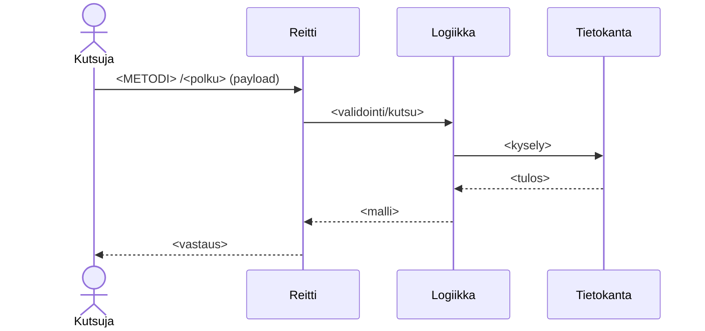

# <Prosessin nimi>

> **Mallipohja.** Kopioi tiedostoksi `moduulit/<moduuli>/prosessit/<nimi>.md`.
> Kuvaa yksi tekninen prosessi: sisääntulo → logiikka → tallennus → paluu.

## Yhteenveto

- **Laukaisin:** `<METODI> /<polku>` (tai eventti / ajastus / komento)
- **Lopputulos:** <mitä palautetaan / mikä sivuvaikutus syntyy>
- **Idempotentti:** <kyllä/ei — ja miksi se on merkityksellistä>

## Sekvenssi

## Vaiheet

> Käytä pysyviä tunnisteita (`### Vaihe n`). Ne eivät muutu, vaikka sisältö
> päivittyy — liiketoiminta- ja datakerros linkittävät näihin. Uusi vaihe
> väliin: `### Vaihe 3b — …`, ei uudelleennumerointia.

### Vaihe 1 — <nimi>

- **Mitä:** <mitä tapahtuu>
- **Koodi:** `<moduuli>/src/...:rivi`
- **Data sisään / ulos:** [<rakenne-sisään>](../datarakenteet/<a>.md) → [<rakenne-ulos>](../datarakenteet/<b>.md)

### Vaihe 2 — <nimi>

- **Mitä:** …
- **Koodi:** …
- **Data:** …

## Virhetilanteet

> Keskeiset virhepolut ja mitä kutsujalle palautetaan. Myös uudelleenyritykset,
> aikakatkaisut ja osittainen eteneminen, jos niitä on.

| Tilanne | Käytös | Kutsujalle | Koodi |
|---------|--------|-----------|-------|
| <esim. validointi epäonnistuu> | <ei sivuvaikutuksia> | `400 <viesti>` | `…:rivi` |

## Liittyvät

- Datavirta: [<virta>](../datavirrat/<x>.md)
- Liiketoimintaprosessi: [<prosessi>](../../../liiketoimintaprosessit/<x>.md)
- Järjestelmäprosessi: [<kulku>](../../../jarjestelmaprosessit/<x>.md)
